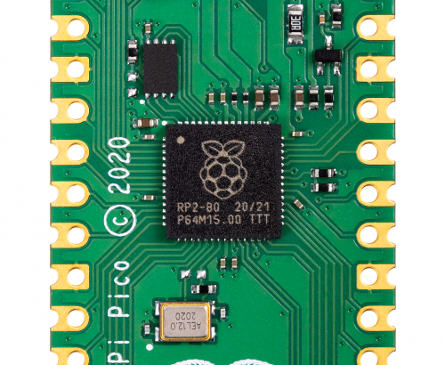

## A GUIDE TO SETTING UP DEVELOPMENT ENVIRONMENT FOR RP2040 MCU

---

RP2040 is a **dual** ARM Cortex-M0+ microcontroller developed by the **Raspberry Pi Foundation.** It is was released along with a development board called the **Raspberry Pi Pico.** 

*image courtsey - [raspberry pi foundation](https://www.raspberrypi.org/documentation/rp2040/getting-started/)*

Several other companies have also designed development boards based on RP2040 microcontroller. However, the pico board from raspberry pi foundation is the best option as it features every thing needed by RP2040 microcontroller to function; moreover, it's form-factor is such that it can be used in industrial products as a surface mount component. Morever, pico board is very cheap and features an onboard buck-boost voltage regulator to power the microcontoller.

**For more information have a look at :**

1. [RP2040 Microcontroller datasheet](https://datasheets.raspberrypi.org/rp2040/rp2040-datasheet.pdf)
2. [Raspberry Pi Pico datasheet](https://datasheets.raspberrypi.org/pico/pico-datasheet.pdf)

>This guide is focussed on application development using C or C++ programming language.

*image courtsey - [raspberry pi foundation](https://www.raspberrypi.org/documentation/rp2040/getting-started/)*

 
 

## Project Setup and build guides
---
1. [MacOS guide](guides/macOS.md)
2. [Windows guide](guides/windows.md)
3. [Linux guide](guides/linux.md)
